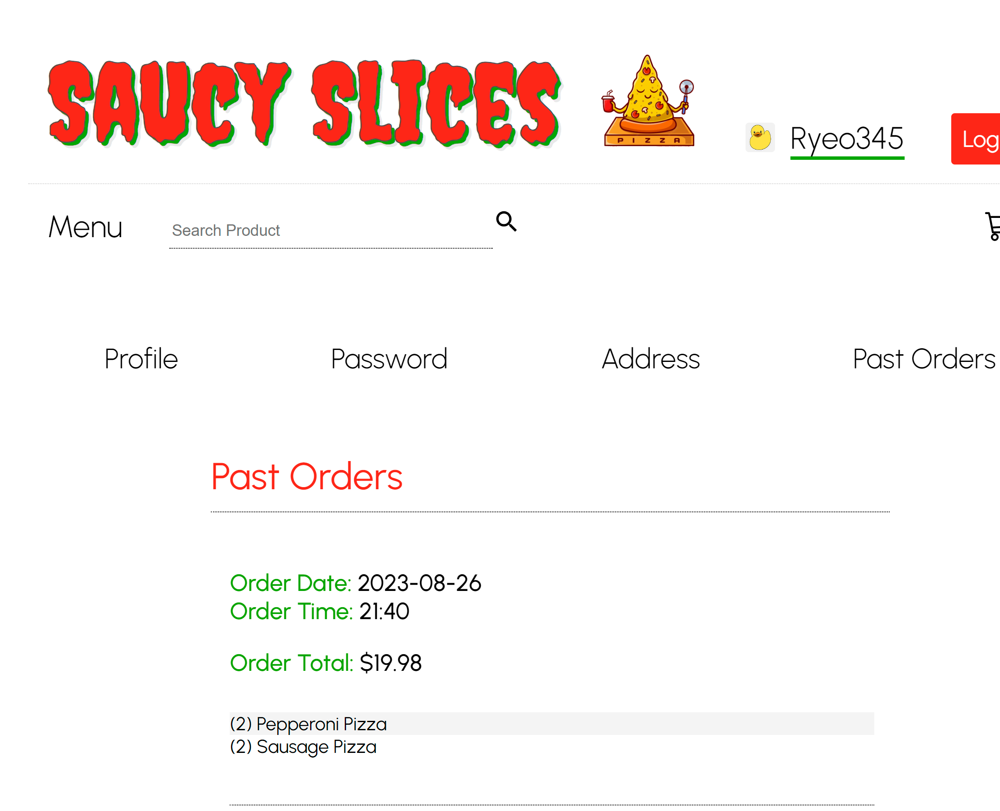

Disclaimer: The following images were used for educational and web development purposes only; no actual food items can be purchased.

Welcome to Saucy Slices!

This marked one of my early projects, inspired by the model set by Papa John's.

The goal was to develop a React application utilizing a comprehensive JavaScript stack, encompassing both frontend and backend aspects. This was successfully executed by leveraging the capabilities of PostgreSQL, Express, React, and Node.js.

A combination of CSS styling and MUI styling was used to design the layout.

Images were acquired through web scraping methods, collecting data from HTTP requests, and Insomnia was employed to transform this data into JSON format. The JSON data was subsequently parsed and iterated through to populate the Product database model using Sequelize and JavaScript. On the frontend, API GET routes were employed to interact with the backend, retrieving data stored in the PostgreSQL database. This retrieved data was then displayed on the frontend, showcasing the array of products available.

API POST routes were employed to link the signup form and the backend database, facilitating the transmission and storage of user data. JSON Web Tokens (JWT) were utilized to authenticate registered users during the login process on the website.

|                  *Signup*       |           *Login*              |
|:-----------------------:|:-----------------------:|
|  |  |

Each type of food was separated into its own React component using the JavaScript filter method. This approach made the code more modular and easier to debug, while also giving me a lot of practice working with React.

|                         |                         |
|:-----------------------:|:-----------------------:|
|  |  |
|  |  |
|  |  |

Creating a CRUD (Create, Read, Update, Delete) system was a must for managing cart items seamlessly. This meant users could easily add or remove items from the cart and adjust prices in real-time when coupons were used. With the CRUD features in place, app could respond dynamically to what users did, ensuring that the cart always had the most accurate and current info.

|        *Cart*           |           *Past Orders*             |
|:-----------------------:|:-----------------------------------:|
|  |  |

More React functionality was added to enhance the user experience by providing detailed nutrition information for each food item. This addition allows users to interact with the website in a more informed and engaging manner.

|            *Individual Item*         |             *Thank You*           |
|:-----------------------------------:|:---------------------------------:|
|  |  |
